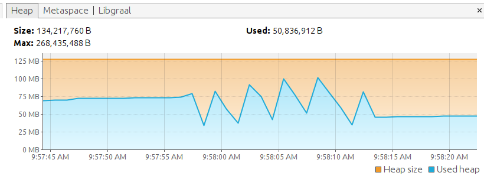

# How to implement a SOAP client with springboot, micronaut and quarkus

In this project you will find 3 examples how to implement a simple soapclient with the 3 most popular microservice frameworks.

There are two options how to get soap actions. You can write all classes by yourself with required annotations or you generate the necessary classes from wsdl.
As the SOAP Services already exists I you only the approach to generate the classes from wsdl. 

To run one of client you will first need to start the SOAP backend service. To do this just run the `docker-compose` script. Then you compile each service with a normal jdk oder graalvm and run the ueber-jar. Thats it. Then you can call each project via browser or you run the jmeter test suite.

# table of contents

* [springboot](#springboot)
* [micronaut](#micronaut)
* [quarkus](#quarkus)
* [startup time](#startup%20time)
* [memory footprint](#memory%20footprint)
* [conclusion](#conclusion)

## springboot

springboot comes with an generic soap client template. to use it you only need to add the dependency `org.springframework.boot:spring-boot-starter-web-services`

1. init the basic project via springboot [initializr](https://start.spring.io/)


notice that I add `Spring Web` dependency for the controller and `Spring Web Services` dependency to implement the soap client.

The `Prometheus` dependency is optional to expose some jvm metrics

Download the zip and extract it.

2. place wsdl in wsdl folder under resources
if you have seperate xsd files you can place it in wsdl folder to or place it into another xsd folder in resource.

3. define jaxb ant task to generate jaxb classes from wsdl

<details>
<summary>Click to show gradle configuration</summary>

in `build.gradle.kts`
```kotlin
val jvmTargetVersion: String by project

val jaxbVersion: String by project

/**
 * JAXB Konfiguration
 */
val jaxb = configurations.create("jaxb") // configures JAXB
val classesDir = "$buildDir/classes/jaxb"
val wsdlDir = "$projectDir/src/main/resources/wsdl"

/**
 * Uses ant task (due to Gradle not having JAXB plugin) for generating Java classes from WSDL/XSD files.
 */
task("genJaxb") {

    val sourcesDir = "$buildDir/generated-sources/jaxb"

    outputs.dir(classesDir)

    doLast {
        project.ant.withGroovyBuilder {
            "taskdef"(
                "name" to "xjc",
                "classname" to "com.sun.tools.xjc.XJCTask",
                "classpath" to jaxb.asPath
            )
            "mkdir"("dir" to sourcesDir)
            "mkdir"("dir" to classesDir)

            "xjc"("destdir" to sourcesDir) {
                "schema"(
                    "dir" to wsdlDir,
                    "includes" to "**/*.wsdl"
                )
                "arg"("value" to "-wsdl")
                "produces"("dir" to sourcesDir, "includes" to "**/*.java")
            }

            "javac"(
                "destdir" to classesDir,
                "source" to jvmTargetVersion, "target" to jvmTargetVersion, "debug" to "true",
                "debugLevel" to "lines,vars,source",
                "classpath" to jaxb.asPath
            ) {
                "src"("path" to sourcesDir)
                "include"("name" to "**/*.java")
                "include"("name" to "*.java")
            }

            "copy"("todir" to classesDir) {
                "fileset"("dir" to sourcesDir, "erroronmissingdir" to "false") {
                    "exclude"("name" to "**/*.java")
                }
            }
        }
    }
}

dependencies {

	jaxb("org.glassfish.jaxb:jaxb-xjc:$jaxbVersion")
    jaxb("org.glassfish.jaxb:jaxb-runtime:$jaxbVersion")
}
```

in `gradle.properties`

```properties
jvmTargetVersion=11
jaxbVersion=2.3.3
```

</details>

4. adding soap libs

<details>
<summary>Click to show gradle configuration</summary>

in `build.gradle.kts`

```kotlin

dependencies {
    implementation("org.springframework.boot:spring-boot-starter-web-services") // this should be there because it was added by spring initializr
    implementation(files(classesDir).builtBy("genJaxb"))
    implementation("org.glassfish.jaxb:jaxb-runtime:$jaxbVersion")
}

```

</details>

5. implement the soap client

<details>
<summary>Click to show `HelloWorldServiceConsumer.kt`</summary>

create class `info.novatec.example.soapclients.springboot.soap.HelloWorldServiceConsumer`

Our soap client needs to implement `org.springframework.ws.client.core.support.WebServiceGatewaySupport`

```kotlin
package info.novatec.example.soapclients.springboot.soap

import org.apache.hello_world_soap_http.types.*
import org.springframework.ws.client.core.support.WebServiceGatewaySupport

class HelloWorldServiceConsumer : WebServiceGatewaySupport() {

    fun ping() {
        // marshalSendAndReceive is a generic method from WebServiceGatewaySupport which accepts JaxB objects
        // be aware that the used JaxB class needs to be a RootElement
        // if this annotation is missing you need to wrap the class inside a JAXBElement
        webServiceTemplate.marshalSendAndReceive(PingMe())
    }

    fun greetMe(name: String): String {
        val greetMeResponse = webServiceTemplate.marshalSendAndReceive(GreetMe().apply {
            requestType = name
        }) as GreetMeResponse
        return greetMeResponse.responseType // the response test is inside the variable responseType
    }

    fun sayHi(): String {
        val sayHiResponse = webServiceTemplate.marshalSendAndReceive(SayHi()) as SayHiResponse
        return sayHiResponse.responseType // the response test is inside the variable responseType
    }
}

```

</details>


6. implement spring config

<details>
<summary>Click to show `HelloWorldServiceConsumerConfig.kt`</summary>

create class `info.novatec.example.soapclients.springboot.soap.HelloWorldServiceConsumerConfig`

```kotlin
package info.novatec.example.soapclients.springboot.soap

import org.springframework.beans.factory.annotation.Value
import org.springframework.context.annotation.Bean
import org.springframework.context.annotation.Configuration
import org.springframework.oxm.jaxb.Jaxb2Marshaller

@Configuration
class HelloWorldServiceConsumerConfig {

// define the package path which is used by jaxb marshaller
// if this is not specified the webservice gateway can't you generate classes
    @Bean
    fun jaxb2Marshaller() = Jaxb2Marshaller().apply {
        setPackagesToScan("org.apache.hello_world_soap_http.types")
    }

// configure the soap client
// add the jaxb marshaller and unmarshaller
// set the soap endpoint (url)
    @Bean
    fun helloWorldServiceConsumer(
        @Value("\${helloWorldService.url}") url: String
    ) =
        HelloWorldServiceConsumer().apply {
            defaultUri = url
            marshaller = jaxb2Marshaller()
            unmarshaller = jaxb2Marshaller()
        }
}
```

</details>

7. implement the controller

<details>
<summary>Click to show `HelloWorldController.kt`</summary>

create class `info.novatec.example.soapclients.springboot.rest.HelloWorldController`

```kotlin
package info.novatec.example.soapclients.springboot.rest

import info.novatec.example.soapclients.springboot.soap.HelloWorldServiceConsumer
import org.springframework.http.MediaType
import org.springframework.http.ResponseEntity
import org.springframework.web.bind.annotation.GetMapping
import org.springframework.web.bind.annotation.PathVariable
import org.springframework.web.bind.annotation.RequestMapping
import org.springframework.web.bind.annotation.RestController

@RestController
@RequestMapping("/hello")
class HelloWorldController(
    // Inject the soap client to use it in our controller
    private val helloWorldServiceConsumer: HelloWorldServiceConsumer
) {

    @GetMapping(value = ["/greetme/{name}"], produces = [MediaType.APPLICATION_JSON_VALUE])
    fun greetMe(@PathVariable name: String): ResponseEntity<String> {

        return ResponseEntity.ok("""{"response":"${helloWorldServiceConsumer.greetMe(name)}"}""")
    }

    @GetMapping(value = ["/sayhi"], produces = [MediaType.APPLICATION_JSON_VALUE])
    fun sayHi(): ResponseEntity<String> {

        return ResponseEntity.ok("""{"response":"${helloWorldServiceConsumer.sayHi()}"}""")
    }
}

```

</details>

8. compile and run the project

```bash
./gradlew clean build
export JAVA_OPTS="-XX:MaxMetaspaceSize=128m -XX:+HeapDumpOnOutOfMemoryError -XX:+ExitOnOutOfMemoryError -Xms256m -Xmx256m -Dfile.encoding=UTF-8 -XX:+UseG1GC"
java $JAVA_OPTS -jar build/libs/springboot-soapclient-1.0.0-SNAPSHOT.jar

```

thats it. :-)


## micronaut

micronaut doesn't have a soap extension. So it's up to us to find a specific soap library. you can use [plain jaxws](https://javaee.github.io/metro-jax-ws/), [apache cxf](https://cxf.apache.org/) or even [axis2](http://axis.apache.org/axis2/java/core/)

I decided to use apache cxf because it addresses all parts of SOAP and it's widly used.

1. init the basic project via micronaut [launch](https://micronaut.io/launch/)


notice that I haven't added specific soap libs, because they are not available inside launcher. we will do it later

The `Prometheus` and `management` dependency are optional to expose some jvm metrics

Download the zip and extract it.

2. place wsdl in wsdl folder under resources
if you have seperate xsd files you can place it in wsdl folder to or place it into another xsd folder in resource.

3. generate cxf client and jaxb classes with gradle plugin [`wsdl2java`](https://plugins.gradle.org/plugin/com.github.bjornvester.wsdl2java)

Thank you [Bjørn](https://plugins.gradle.org/u/bjornvester) for this plugin

<details>
<summary>Click to show gradle configuration</summary>

in `settings.gradle.kts`
```kotlin
pluginManagement {

    plugins {
        
        val wsdl2javaVersion: String by settings

        id("com.github.bjornvester.wsdl2java") version wsdl2javaVersion
    }
}
```

in `gradle.properties`

```properties
wsdl2javaVersion=1.1
```

</details>

now you can generate required cxf classes via `./gradlew wsdl2java`

4. adding cxf libraries

<details>
<summary>Click to show gradle configuration</summary>

in build.gradle.kts

```kotlin

val cxfVersion: String by project
val slf4jVersion: String by project

dependencies {

    /** cxf libs */
    implementation("org.apache.cxf:cxf-rt-frontend-jaxws:$cxfVersion")
    implementation("org.apache.cxf:cxf-rt-transports-http:$cxfVersion")
    implementation("org.slf4j:log4j-over-slf4j:$slf4jVersion")
}
```

in gradle.properties

```kotlin
slf4jVersion=1.7.28
cxfVersion=3.4.4
```
</details>

5. implementing a factory for cxf soap client

micronaut uses factory annotation to init beans from third party libraries.

<details>
<summary>Click to show `HelloWorldServiceConsumerFactory.kt`</summary>

create class `info.novatec.examples.soapclient.micronaut.soap.HelloWorldServiceConsumerFactory`

```kotlin
package info.novatec.examples.soapclient.micronaut.soap

import io.micronaut.context.annotation.Factory
import io.micronaut.context.annotation.Value
import org.apache.hello_world_soap_http.Greeter
import org.apache.hello_world_soap_http.SOAPService
import javax.xml.ws.BindingProvider

import javax.inject.Singleton

@Factory
class HelloWorldServiceConsumerFactory {

    @Singleton
    // Greeter is the soap service interface
    // SoapService is the client
    // to change the default endpoint from wsdl you have to change the ENDPOINT_ADDRESS_PROPERTY from requestContext
    fun cxfGreeterService(@Value("\${greeter.url}") endpointUrl: String): Greeter {
        val cxfClient: Greeter = SOAPService().soapPort
        (cxfClient as BindingProvider).requestContext[BindingProvider.ENDPOINT_ADDRESS_PROPERTY] =
            endpointUrl
        return cxfClient
    }
}
```

now we can you cxf client inside our soapclient
</details>

6. implementing our soap client

<details>
<summary>Click to show `HelloWorldServiceConsumer.kt`</summary>

create class `info.novatec.examples.soapclient.micronaut.soap.HelloWorldServiceConsumer`

```kotlin
package info.novatec.examples.soapclient.micronaut.soap

import org.apache.hello_world_soap_http.Greeter
import javax.inject.Inject
import javax.inject.Singleton

@Singleton
class HelloWorldServiceConsumer(
    private val cxfGreeterService: Greeter // inject the cxf soap client which is init by the factory 
) {

    fun ping() {
        cxfGreeterService.pingMe()
    }

    fun greetMe(name: String) = cxfGreeterService.greetMe(name)

    fun sayHi() = cxfGreeterService.sayHi()

}
```

</details>


7. Implement controller

<details>
<summary>Click to show `HelloWorldController.kt`</summary>

create class `info.novatec.examples.soapclient.micronaut.api.HelloWorldController`

```kotlin
package info.novatec.examples.soapclient.micronaut.api

import info.novatec.examples.soapclient.micronaut.soap.HelloWorldServiceConsumer
import io.micronaut.http.MediaType
import io.micronaut.http.annotation.Controller
import io.micronaut.http.annotation.Get
import io.micronaut.http.annotation.PathVariable
import io.micronaut.http.annotation.Produces

@Controller("/hello")
class HelloWorldController(
    private val helloWorldServiceConsumer: HelloWorldServiceConsumer
) {

    @Get("/greetme/{name}")
    @Produces(MediaType.APPLICATION_JSON)
    fun greetme(@PathVariable("name") name: String) =
        """{"response":"${helloWorldServiceConsumer.greetMe(name)}"}"""

    @Get("/sayhi")
    @Produces(MediaType.APPLICATION_JSON)
    fun sayHi() = """{"response":"${helloWorldServiceConsumer.sayHi()}"}"""
}
```

</details>

8. compile and run the project

```bash
./gradlew clean wsdl2java build distTar

export JAVA_OPTS="-XX:MaxMetaspaceSize=64m -XX:+HeapDumpOnOutOfMemoryError -XX:+ExitOnOutOfMemoryError -Xms128m -Xmx128m -Dfile.encoding=UTF-8 -XX:+UseG1GC"

tar -C build/distributions -xvf build/distributions/micronaut-soapclient-1.0.0-SNAPSHOT.tar
echo "start micronaut soapclient example"
build/distributions/micronaut-soapclient-1.0.0-SNAPSHOT/bin/micronaut-soapclient
```

thats it. :-)


## quarkus

quarkus doesn't have a soap extension directly. but it has a community extension [quarkus-cxf](https://github.com/quarkiverse/quarkus-cxf) which is listed on [quarkiverse](https://github.com/quarkiverse).

1. init the basic project via quarkus [code](https://code.quarkus.io/)


I added kotlin extension and RESTeasy extension

notice that I haven't added specific soap libs, because they are not available inside launcher. we will do it later

The `Prometheus` extension is optional to expose some jvm metrics

Download the zip and extract it.

2. place wsdl in wsdl folder under resources
if you have seperate xsd files you can place it in wsdl folder to or place it into another xsd folder in resource.

3. generate cxf client and jaxb classes with gradle plugin [`wsdl2java`](https://plugins.gradle.org/plugin/com.github.bjornvester.wsdl2java)

Thank you [Bjørn](https://plugins.gradle.org/u/bjornvester) for this plugin

<details>
<summary>Click to show gradle configuration</summary>

in `settings.gradle.kts`
```kotlin
pluginManagement {

    plugins {
        
        val wsdl2javaVersion: String by settings

        id("com.github.bjornvester.wsdl2java") version wsdl2javaVersion
    }
}
```

in `gradle.properties`

```properties
wsdl2javaVersion=1.1
```

</details>

now you can generate required cxf classes via `./gradlew wsdl2java`

4. adding cxf extension

<details>
<summary>Click to show gradle configuration</summary>

in build.gradle.kts

```kotlin

val quarkusCxfVersion: String by project

dependencies {

    /** cxf libs */
    implementation("io.quarkiverse.cxf:quarkus-cxf:$quarkusCxfVersion")
}
```

in gradle.properties

```kotlin
quarkusCxfVersion=0.9
```

</details>

5. configure quarkus cxf extension


<details>
<summary>Click to show `application.properties`</summary>

```properties
# the name of the bean will be greeterService
# and the bean implements the Greeter Interface which is generated by wsdl2java gradle plugin
quarkus.cxf.client."greeterService".service-interface=org.apache.hello_world_soap_http.Greeter
# the client will you send requests to this urk
quarkus.cxf.client."greeterService".client-endpoint-url=http://localhost:9080/MockService
```

now we can inject the bean greeterService into our own consumer

</details>

6. implementing our soap client

<details>
<summary>Click to show `HelloWorldServiceConsumer.kt`</summary>

create class `info.novatec.examples.soapclient.quarkus.soap.HelloWorldServiceConsumer`

```kotlin
package info.novatec.examples.soapclient.quarkus.soap

import io.quarkiverse.cxf.annotation.CXFClient
import org.apache.hello_world_soap_http.Greeter
import javax.enterprise.context.ApplicationScoped

@ApplicationScoped
class HelloWorldServiceConsumer(
    @CXFClient("greeterService") // with this annotation the cxf client is injected into our consumer and we can use it directly
    private val cxfGreeterService: Greeter
) {

    fun ping() {
        cxfGreeterService.pingMe()
    }

    fun greetMe(name: String) = cxfGreeterService.greetMe(name)

    fun sayHi() = cxfGreeterService.sayHi()
}
```

</details>


7. Implement resource (aka controller)

<details>
<summary>Click to show `GreetingResource.kt`</summary>

create class `info.novatec.examples.soapclient.quarkus.GreetingResource`

```kotlin
package info.novatec.examples.soapclient.quarkus

import info.novatec.examples.soapclient.quarkus.soap.HelloWorldServiceConsumer
import javax.inject.Inject
import javax.ws.rs.GET
import javax.ws.rs.Path
import javax.ws.rs.PathParam
import javax.ws.rs.Produces
import javax.ws.rs.core.MediaType

@Path("/hello")
class GreetingResource(
    private val helloWorldServiceConsumer: HelloWorldServiceConsumer
) {

    @GET
    @Path("/greetme/{name}")
    @Produces(MediaType.APPLICATION_JSON)
    fun greetme(@PathParam("name") name: String) =
        """{"response":"${helloWorldServiceConsumer.greetMe(name)}"}"""

    @GET
    @Path("/sayhi")
    @Produces(MediaType.APPLICATION_JSON)
    fun sayHi() = """{"response":"${helloWorldServiceConsumer.sayHi()}"}"""

}
```

</details>

8. compile and run the project

```bash
./gradlew clean wsdl2java quarkusBuild -Dquarkus.package.type=uber-jar 

export JAVA_OPTS="-XX:MaxMetaspaceSize=64m -XX:+HeapDumpOnOutOfMemoryError -XX:+ExitOnOutOfMemoryError -Xms128m -Xmx128m -Dfile.encoding=UTF-8 -XX:+UseG1GC"

echo "start quarkus soapclient example"
java $JAVA_OPTS -jar build/quarkus-soapclient-1.0.0-SNAPSHOT-runner.jar
```

thats it. :-)


## startup time

### springboot


### micronaut


### quarkus


## memory footprint

### springboot


### micronaut




### quarkus


## conclusion

The easiest way to implement a soap client was with quarkus. thanks to the community who provides this awesome extension. they promise it will work as native image as well. I haven't tested it yet. but even without native image the memory footprint and startup time are very small. 

The generic approach from spring works fine. but I don't like the ant task in the gradle file and when your jaxb classes doesn't have a rootelement annotation you need to wrap it into a JAXBElement. Also the memory and the startup time even in this small project can be problematic when it comes to cloud services and you need to start more containers based on load and you still want to save some memory.

With the micronaut approach you have the greatest flexibility when it comes to use cxf. but it can be problematic to generate a native image. but this is not handled by this tutorial.

When I could choose a framework in my project for this case I would choose quarkus. but thats only my personal decision.

## more to read

